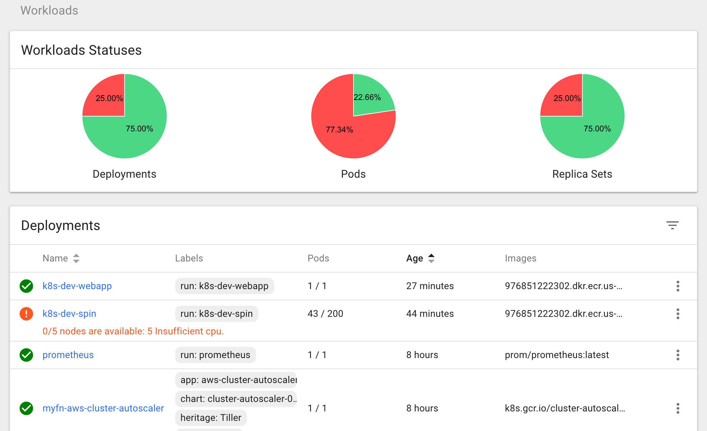
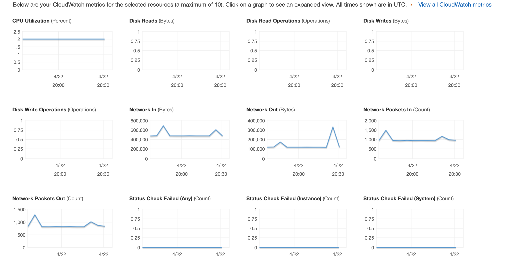

Constellation
=============================================
**Proof of concept for auto-scaling applications via AWS EKS, driven by CI**

---

[](https://github.com/your/your-project/blob/master/LICENSE)
[![Powered by Modus_Create](https://img.shields.io/badge/powered_by-Modus_Create-blue.svg?longCache=true&style=flat&logo=data:image/svg+xml;base64,PHN2ZyB2aWV3Qm94PSIwIDAgMzIwIDMwMSIgeG1sbnM9Imh0dHA6Ly93d3cudzMub3JnLzIwMDAvc3ZnIj4KICA8cGF0aCBkPSJNOTguODI0IDE0OS40OThjMCAxMi41Ny0yLjM1NiAyNC41ODItNi42MzcgMzUuNjM3LTQ5LjEtMjQuODEtODIuNzc1LTc1LjY5Mi04Mi43NzUtMTM0LjQ2IDAtMTcuNzgyIDMuMDkxLTM0LjgzOCA4Ljc0OS01MC42NzVhMTQ5LjUzNSAxNDkuNTM1IDAgMCAxIDQxLjEyNCAxMS4wNDYgMTA3Ljg3NyAxMDcuODc3IDAgMCAwLTcuNTIgMzkuNjI4YzAgMzYuODQyIDE4LjQyMyA2OS4zNiA0Ni41NDQgODguOTAzLjMyNiAzLjI2NS41MTUgNi41Ny41MTUgOS45MjF6TTY3LjgyIDE1LjAxOGM0OS4xIDI0LjgxMSA4Mi43NjggNzUuNzExIDgyLjc2OCAxMzQuNDggMCA4My4xNjgtNjcuNDIgMTUwLjU4OC0xNTAuNTg4IDE1MC41ODh2LTQyLjM1M2M1OS43NzggMCAxMDguMjM1LTQ4LjQ1OSAxMDguMjM1LTEwOC4yMzUgMC0zNi44NS0xOC40My02OS4zOC00Ni41NjItODguOTI3YTk5Ljk0OSA5OS45NDkgMCAwIDEtLjQ5Ny05Ljg5NyA5OC41MTIgOTguNTEyIDAgMCAxIDYuNjQ0LTM1LjY1NnptMTU1LjI5MiAxODIuNzE4YzE3LjczNyAzNS41NTggNTQuNDUgNTkuOTk3IDk2Ljg4OCA1OS45OTd2NDIuMzUzYy02MS45NTUgMC0xMTUuMTYyLTM3LjQyLTEzOC4yOC05MC44ODZhMTU4LjgxMSAxNTguODExIDAgMCAwIDQxLjM5Mi0xMS40NjR6bS0xMC4yNi02My41ODlhOTguMjMyIDk4LjIzMiAwIDAgMS00My40MjggMTQuODg5QzE2OS42NTQgNzIuMjI0IDIyNy4zOSA4Ljk1IDMwMS44NDUuMDAzYzQuNzAxIDEzLjE1MiA3LjU5MyAyNy4xNiA4LjQ1IDQxLjcxNC01MC4xMzMgNC40Ni05MC40MzMgNDMuMDgtOTcuNDQzIDkyLjQzem01NC4yNzgtNjguMTA1YzEyLjc5NC04LjEyNyAyNy41NjctMTMuNDA3IDQzLjQ1Mi0xNC45MTEtLjI0NyA4Mi45NTctNjcuNTY3IDE1MC4xMzItMTUwLjU4MiAxNTAuMTMyLTIuODQ2IDAtNS42NzMtLjA4OC04LjQ4LS4yNDNhMTU5LjM3OCAxNTkuMzc4IDAgMCAwIDguMTk4LTQyLjExOGMuMDk0IDAgLjE4Ny4wMDguMjgyLjAwOCA1NC41NTcgMCA5OS42NjUtNDAuMzczIDEwNy4xMy05Mi44Njh6IiBmaWxsPSIjRkZGIiBmaWxsLXJ1bGU9ImV2ZW5vZGQiLz4KPC9zdmc+)](https://moduscreate.com)

# Constellation Kubernetes Dashboard example


The fleet of Kubernetes worker nodes scales up and down in response to demand.

# Problem Description
[Modus Create](https://moduscreate.com/) has multiple customers who are interested in reducing their AWS bills through containerizing their applications for development and production. Generally customers in an intermediate stage of AWS adoption run a many different EC2 instances with one application per instance, on relatively large and expensive instance types. This fleet of instances are not very busy overall with respect to CPU and memory usage.

If it were possible to define smaller, horizontally scalable sets of containers an entire set of environments (e.g. Dev, QA, or Prod) could be collapsed onto many fewer servers, reducing TCO significantly. If the fleet of containers could then dynamically scale out as CPU usage (or another critical metric) increased, this would demonstrate the proof of concept of a dynamically scaled container fleet.

# Solution
This project uses AWS and Kubernetes (via [AWS EKS](https://aws.amazon.com/eks/)) to demonstrate auto scaling. It uses a test harness load sink application called `spin.py` that can be driven to induce high loads to verify that the auto scaling is working correctly, and a test harness control application that is separate to show that the cluster will stay responsive for other applications even while it is under load. The worker nodes should be spread across at least 2 AWS availability zones.

# Implementation
We use Terraform to define the EKS control plane and supporting resources. This demonstrates that we can deploy an application and have it scale out while maintaining an adequate quality of service for other applications in the cluster.

This uses pod autoscaling in conjunction with cluster autoscaling to scale out a set of 2 applications in it: one application that is just nginx serving up a simple HTML page and set of static resources, and another application `spin.py` that is a Python application built with Bottle that has an `/api/spin` GET endpoint that will spin the CPU for 2 seconds and return a `text/plain` response that describes the node and characteristics of the run. The python application uses WSGI and is run through the Emperor WSGI server. An ingress controller allows access to the applications. We can monitor the Kubernetes cluster with Prometheus.

See attached `spin.py` for some code tested to spin the CPU. The index document for the web site can be the A REST-ful endpoint `/spin` will eat CPU time. You could use Docker Compose to test the 2 applications locally before deploying them to Kubernetes.

# Testing
To test the scale-out characteristics, use JMeter to apply one thread group with a Ramp to Fail / Stress test load to the `/api/spin` application and another thread group that applies a steady state load to the other application.

The JMeter load tests under the `applications/appname/jmeter` tests serve to demonstrate this scaling.

You can measure the latency to the simple web application and ensure that it says relatively steady as the load ramps up. You can measure the size of the cluster as the load grows. You can measure the CPU utilization across the fleet during the test.

# Instructions
 To run the demo end to end, you will need:
 
* [AWS Account](https://aws.amazon.com/)
* [Docker](https://docker.com/) (tested with 18.05.0-ce)
* [Terraform](https://www.terraform.io/) (tested with  v0.11.7)

Optionally, you can use Jenkins to orchestrate creation of AWS resources in conjunction with GitHub branches and pull requests.

You will also need to set a few environment variables. The method of doing so will vary from platform to platform. 

```
AWS_PROFILE
AWS_DEFAULT_PROFILE
AWS_DEFAULT_REGION
AWS_ACCESS_KEY_ID
AWS_SECRET_ACCESS_KEY
```

A [sample file](env.sh.sample) is provided as a template to customize:

```
cp env.sh.sample env.sh
vim env.sh
. env.sh
```

The AWS profile IAM user should have full control of EC2 in the account you are using.

## Jenkins

A `Jenkinsfile` is provided that will allow Jenkins to execute Terraform. In order for Jenkins to do this, it needs to have AWS credentials set up, preferably through an IAM role, granting full control of EC2 and VPC resources in that account. Terraform needs this to create a VPC and EC2 resources. This could be pared down further through some careful logging and role work.

## Requirements
- An ECR repository to store the images.
- The command line utility 'jq'.
- aws-iam-authenticator
	```
	curl -o /usr/local/bin/aws-iam-authenticator https://amazon-eks.s3-us-west-2.amazonaws.com/1.11.5/2018-12-06/bin/linux/amd64/aws-iam-authenticator
    chmod 755 /usr/local/bin/aws-iam-authenticator
	```
    If 'aws-iam-authenticator' isn't installed, prep.sh will install it from the AWS repository.
- kubectl:
	```
	curl -o /usr/local/bin/kubectl https://amazon-eks.s3-us-west-2.amazonaws.com/1.11.5/2018-12-06/bin/linux/amd64/kubectl
    chmod 755 /usr/local/bin/kubectl
	```
    If 'kubectl' isn't installed, prep.sh will install it from the AWS repository.

- helm:
    ```
    brew install kubernetes-helm
    ```
    or
    ```
    https://github.com/helm/helm/releases
    ```
- tiller:
    Run these commands to install the tiller cli:
    ```
    cd /tmp
    sudo helm init
    ```

## Terraform

This Terraform setup stores its state in Amazon S3 and uses DynamoDB for locking. There is a bit of setup required to bootstrap that configuration. You can use [this repository](https://github.com/monterail/terraform-bootstrap-example) to use Terraform to do that bootstrap process. The `backend.tfvars` file in that repo should be modified as follows to work with this project:

(Replace us-east-1 and XXXXXXXXXXXX with the AWS region and your account ID)
```
bucket = "tf-state.k8s-eks-scaling-demo.us-east-1.XXXXXXXXXXXX"
dynamodb_table = "TerraformStatelock-k8s-eks-scaling-demo"
key = "terraform.tfstate"
profile = "terraform"
region = "us-east-1"
```
You'll also need to modify the list of operators who can modify the object in the S3 bucket. Put in the IAM user names of the user into the `setup/variables.tf` file in that project. If your Jenkins instance uses an IAM role to grant access, give it a similar set of permissions to those granted on in the bucket policy to IAM users.

These commands will then set up cloud resources using terraform:
 
    cd terraform
    terraform init
    terraform get
    # Example with values from our environment (replace with values from your environment)
    # terraform plan -var domain=modus.app -out tf.plan
    terraform plan -out tf.plan -var 'domain=example.net'
    terraform apply tf.plan
    # check to see if everything worked - use the same variables here as above
    terraform destroy -var 'domain=example.net'

This assumes that you already have a Route 53 domain in your AWS account created.
You need to either edit variables.tf to match your domain and AWS zone or specify these values as command line `var` parameters.

## Building and Starting the Demo
At any time you can enter "./bin/build.sh help" for the available commands.

```
./bin/build.sh stand-up-demo

```
Connect a browser to test these endpoints:

* http://eks-demo-webapp.moduscreate.com
* http://eks-demo-spin.moduscreate.com
* http://eks-demo-spin.moduscreate.com/api/spin

## Monitoring the applications

Run this command to start up and connect to the dashboard:
```
./bin/build.sh proxy-dashboard
```

Follow the instructions it gives, connect a browser to the dashboard, and login with the token.

## Induce load that will scale out the application
Run this command in one terminal window to put load on the web application to make it scale out:
```
./bin/build.sh run-jmeter-www webapp
```

Run this command in another terminal window to put load on the load sink `spin.py` application to make it scale out:
``` 
./bin/build.sh run-jmeter-www spin
```

Once you have run the commands to make JMeter apply load to the tests, look at the Prometheus dashboard where you will be able to observe increasing pod and node counts. By looking at these and the request and response rates in JMeter, you will get a good idea about how the applications are scaling out.


## Useful commands

Here are some useful commands you might use to inspect the running cluster:
```
./bin/build.sh kubeconfig  # run this first to update the config in your home directory
kubectl top node
kubectl top pod
kubectl get hpa
kubectl get deployments
kubectl get rs
kubectl get pods
kubectl describe deployments
kubectl scale deployment.v1.apps/k8s-dev-spin --replicas=10
kubectl get deployment metrics-server -n kube-system
kubectl get --raw "/apis/metrics.k8s.io/v1beta1/nodes"
kubectl run -i --tty load-generator --image=busybox /bin/sh
kubectl -n metrics logs -l app=metrics-server
```

## Stopping the Demo
Stop the demo with this command:
```
./bin/build.sh tear-down-demo
```

## Development Notes
- Run './bin/build.sh help' for help on building applications.
- The ECR repositories are not currently created by Terraform. Depending on the goals of the demo they could be managed by Terraform.
- For EKS to report CPU usage to the metrics server, the 'kubectl run' command needs a cpu limit applied: EG: "--limits=cpu=200m,memory=512Mi" 

## CloudWatch



# References
The code is based in part on commit 61bee0b7858bbcd3d4276f186cc4cc7bf298ac11 from the [ModusCreateOrg/devops-infra-demo](https://github.com/ModusCreateOrg/devops-infra-demo/) repository.

## Kubernetes - https://kubernetes.io/
* https://github.com/aws-samples/aws-workshop-for-kubernetes - workshop tutorial on using EKS for running Kubernetes cluster - I reccomend doing this to get familiar with it
* https://kubernetes.io/docs/tasks/run-application/horizontal-pod-autoscale/ - Horizontal Pod Autoscaling
* https://github.com/kubernetes/autoscaler/tree/master/cluster-autoscaler - Cluster autoscaler
* https://medium.com/magalix/kubernetes-autoscaling-101-cluster-autoscaler-horizontal-pod-autoscaler-and-vertical-pod-2a441d9ad231 - article on autoscaling both horizontally, vertically, and through the cluster
* https://aws.amazon.com/blogs/opensource/horizontal-pod-autoscaling-eks/ - AutoScaling had been broken in EKS until recently, but it's fixed now
* https://prometheus.io/ - Prometheus, an open source metrics server for Kubernetes clusters
* https://github.com/kubernetes-sigs/aws-alb-ingress-controller - ALB ingress controller
* https://github.com/kubernetes/ingress-nginx - NGINX ingress controller

## Terraform - https://terraform.io
* https://www.terraform.io/docs/providers/aws/guides/eks-getting-started.html - EKS Terraform Getting Started guide
* https://github.com/ModusCreateOrg/devops-infra-demo - contains a working Terraform integration with Jenkins CI, adapt this as a starting point
* https://www.hashicorp.com/resources/solutions-engineering-terraform-k8s-aws-eks - Screencast from Hashicorp about using Terraform to create an EKS cluster
* https://github.com/jboero/terraform-guides/tree/hashihang/infrastructure-as-code/k8s-cluster-eks/provision-cluster - code related to the above demo. *NOTE* - if we adapt code from this repo, _we have to license our code under the MPL 2.0_ instead of the MIT license as we usually do. So _think carefully_ and consult Richard and Grgur and Murthy before directly adapting that code. It might be better to start from first principles and use the EKS Terraform Getting Started Guide instead
* https://blog.gruntwork.io/terraform-tips-tricks-loops-if-statements-and-gotchas-f739bbae55f9 - a fine article on Terraform tricks that has been instrumental in our previous Terraform projects

## Docker - https://docker.io
* https://www.caktusgroup.com/blog/2017/03/14/production-ready-dockerfile-your-python-django-app/ - A good uWSGI-compatible Dockerfile and Docker Compose file the authors have given permission for others to use as a starting point for Python containers runing WSGI applications
* https://hub.docker.com/_/nginx/ - official NGINX Docker container, use this to serve up the simple web application


## Python - https://www.python.org/
* https://bottlepy.org/docs/dev/tutorial.html - Bottle (super simple REST-ful web server framework)

## Jenkins - https://jenkins.io/
* https://jenkins.io/doc/book/pipeline/jenkinsfile/ - Using a Jenkinsfile

## Jmeter - https://jmeter.apache.org/
* https://moduscreate.com/blog/jmeter-performance-testing/ - JMeter tutorial
* https://moduscreate.com/blog/performance-remediation-using-new-relic-jmeter-part-1-3/ - JMeter performance monitoring article (part 1)
* https://moduscreate.com/blog/performance-remediation-using-new-relic-jmeter-part-2-3/ - JMeter performance monitoring article (part 2) - has load test type definitions


# Modus Create

[Modus Create](https://moduscreate.com) is a digital product consultancy. We use a distributed team of the best talent in the world to offer a full suite of digital product design-build services; ranging from consumer facing apps, to digital migration, to agile development training, and business transformation.

[](https://moduscreate.com)

This project is part of [Modus Labs](https://labs.moduscreate.com).

[](https://labs.moduscreate.com)

# Licensing

This project is [MIT licensed](./LICENSE).

The content in `application` is adapted from _Dimension_ by https://html5up.net/ and is [licensed under a Creative Commons Attribution 3.0 License](https://html5up.net/license) See its [README.md](application/README.md) and [LICENSE.md](application/LICENSE.md) files for more details.

